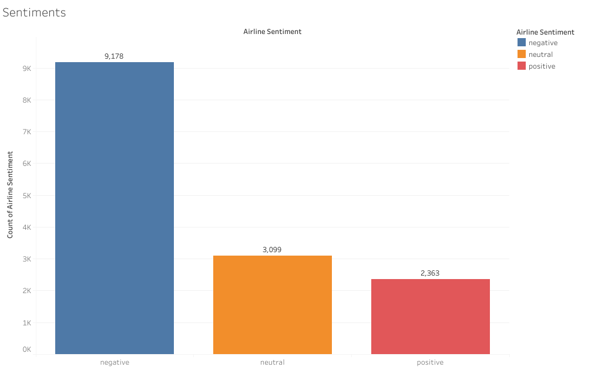
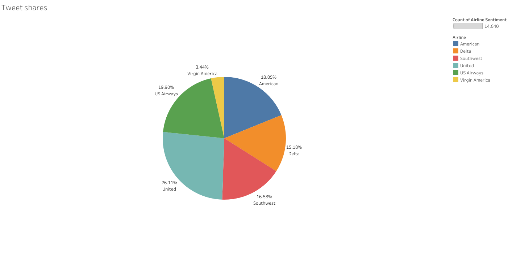

# Airline Sentiment Analysis

This repository contains the analysis and visualization of airline sentiment data, aimed at understanding customer feedback across various airlines. Using data on customer sentiments—categorized as negative, neutral, or positive—this project uncovers trends and insights that could help airlines enhance customer satisfaction and address common issues.



## Overview

### 1. Sentiment Analysis
The dataset reveals that customer sentiment skews heavily toward negative feedback, with a significant portion of the reviews reflecting dissatisfaction. This outcome aligns with well-documented research suggesting that unsatisfied customers are more likely to share their experiences than satisfied ones.

### 2. Tweet Shares
To provide context on how these sentiments are distributed across different airlines, a pie chart was generated. This visualization indicates the proportion of total feedback each airline receives, with United Airlines leading in terms of volume.



### 3. Negative Sentiment Reasons
One of the focal points of this analysis is to break down the reasons behind negative sentiments. The analysis shows that specific issues, such as delays and customer service quality, frequently drive negative reviews. Each airline has its unique distribution of complaint types, which are illustrated in separate bar charts to avoid overcrowding and enhance clarity.

## Key Insights

- **Customer Sentiment**: The majority of feedback is negative, emphasizing areas where airlines could focus on improvement.
- **Airline-Specific Feedback**: Different airlines have varied distribution of feedback, with United Airlines receiving the most mentions.
- **Common Complaints**: Across all airlines, delays and poor customer service are predominant reasons for negative feedback, offering a clear target for improvement strategies.

## Future Work

This project serves as a foundation for further investigation. Future work could involve:
- **Predictive Modeling**: Building models to predict customer sentiment based on key factors.
- **Sentiment Drivers**: Analyzing which specific events or policies lead to spikes in negative or positive sentiment.
- **Real-Time Monitoring**: Implementing real-time tracking of sentiment to allow airlines to respond more quickly to emerging issues.

## How to Use This Repository

1. **Clone the Repository**: 
   ```bash
   git clone https://github.com/yourusername/airline-sentiment-analysis.git
   ```
2. **Navigate to the Directory**:
   ```bash
   cd airline-sentiment-analysis
   ```
3. **Run the Jupyter Notebook**: 
   Open the `Airline sentiment analysis.ipynb` in Jupyter Notebook to explore the data and visualizations.
   
4. **Explore the Data**:
   - The notebook provides step-by-step instructions for performing the analysis.
   - Modify the visualizations or analysis as needed to explore different aspects of the data.

## Contributing

Contributions are welcome! If you have any ideas for improvement or additional analysis, feel free to fork the repository and submit a pull request.
